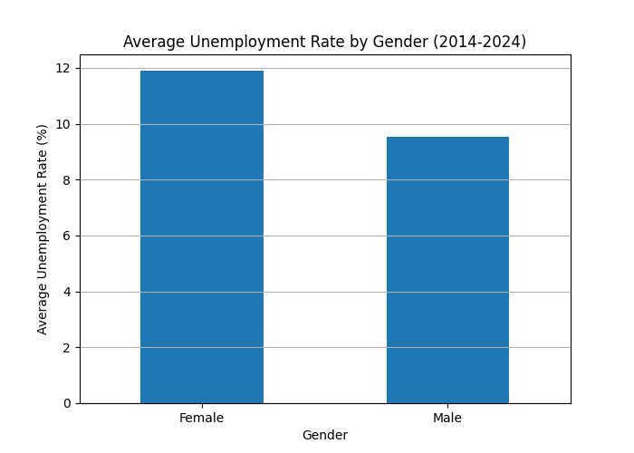
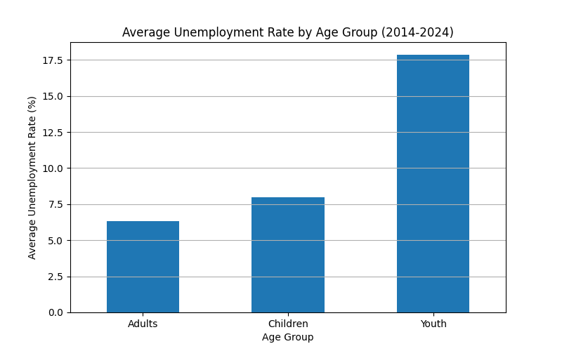
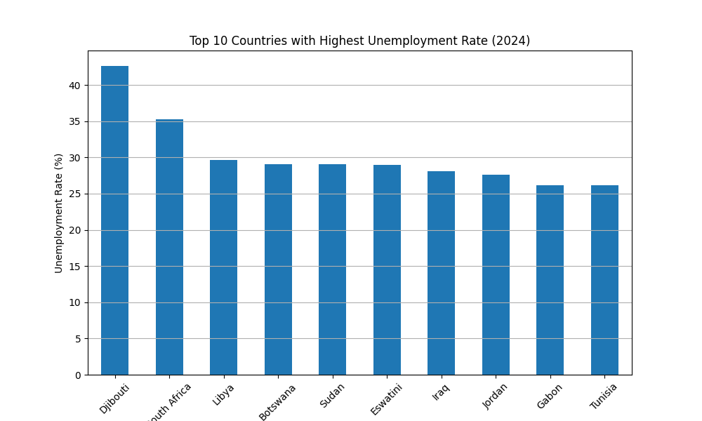
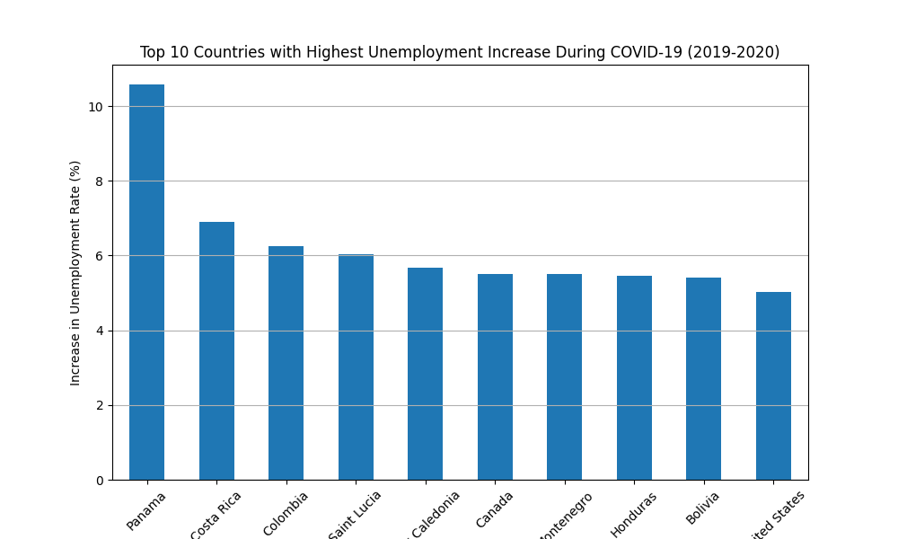

# 📊 Unemployment Analysis

### Python | Pandas | Matplotlib Project

## 📌 Project Overview

**Unemployment Analysis** is a data analytics project that explores global unemployment patterns using demographic and economic data.

The project focuses on analyzing unemployment trends across different years, countries, genders, and age groups to identify significant patterns and insights.

The analysis was performed using Python-based data analysis tools, including **Pandas** for data processing and **Matplotlib** for data visualization.

---

# 🎯 Project Objectives

The main objectives of this project are:

- Analyze global unemployment trends from 2014 to 2024.
- Understand unemployment variations across different countries.
- Compare unemployment rates between male and female populations.
- Study unemployment patterns among different age groups.
- Analyze the impact of the COVID-19 pandemic on unemployment.
- Generate meaningful insights through data visualization.

---

# 📂 Dataset Description

The dataset contains demographic unemployment information including:

- Country details
- Gender categories
- Age groups
- Year-wise unemployment rates
- Population-based unemployment statistics

**Data Period:** 2014 – 2024

---

# 🛠️ Technologies & Tools Used

| Category | Tools |
|----------|-------|
| Programming Language | Python |
| Data Analysis | Pandas, NumPy |
| Data Visualization | Matplotlib |
| Development Environment | Jupyter Notebook / Google Colab |
| Version Control | GitHub |

---

# 🔍 Data Analysis Workflow

## 1. Data Cleaning & Preparation

Performed data preprocessing steps:

- Checked dataset structure
- Handled missing values
- Removed duplicate records
- Verified data consistency
- Prepared data for analysis

## 2. Exploratory Data Analysis (EDA)

Performed analysis to identify:

- Country-level unemployment differences
- Gender-based unemployment patterns
- Age group unemployment variations
- COVID-19 unemployment impact

---

# 📊 Data Visualizations

## 👥 Gender-Based Unemployment Analysis

---

## 🎯 Age Group Unemployment Analysis

---

## 🌍 Top 10 Countries With Highest Unemployment Rate (2024)

---

## 🦠 COVID-19 Impact Analysis (2019 vs 2020)

---

# 📌 Key Insights

Based on the analysis:

- Global unemployment showed a gradual decline before 2020.
- A major increase in unemployment was observed during the COVID-19 pandemic.
- Female unemployment rates were higher compared to male unemployment rates.
- Youth unemployment remained a major concern across several regions.
- Countries such as Djibouti and South Africa recorded higher unemployment levels in recent years.
- Economic events significantly influenced unemployment trends worldwide.

---

# 🚀 Project Outcome

This project demonstrates practical skills in:

- Data Cleaning
- Exploratory Data Analysis (EDA)
- Data Visualization
- Python Programming
- Extracting insights from real-world datasets

---

# 👨‍💻 Author

**AAKASH P**

B.Tech Information Technology Student

**Intern Alpha Internship Project**

GitHub:  
https://github.com/aakashp2008
